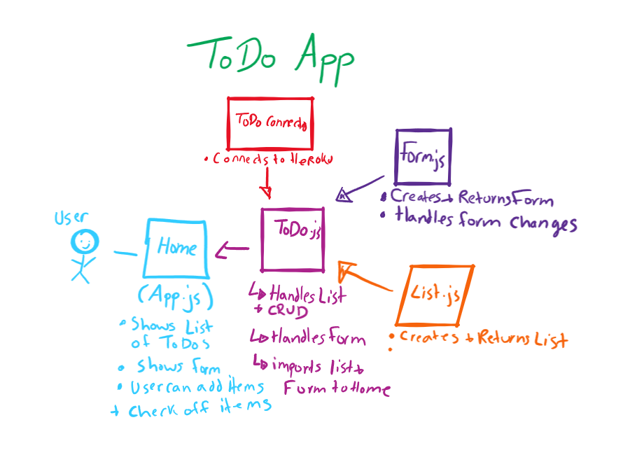

# TODO 

# Phase 1
* Basic To Do List Management, using Hooks

# Phase 2 
* As a user, I would like to be able to add, update, and delete To Do items
* As a user, I would like my To Do Items to be permanently stored so that I can re-access them at any time, using any device

# Phase 3
* As a user, I would like to see my To Do List Items a few at a time so that I don’t have to wade through them all
* As a user, I would like my default view to only be “Incomplete” Items so that I can quickly determine what I have to do.
* As a user, I would like my list sorted by difficulty so that I can more easily prioritize
* As a user, I would like the option to change my default preferences with regards to how many Items I see per page, which items are filtered, and how they are sorted

# UML 

